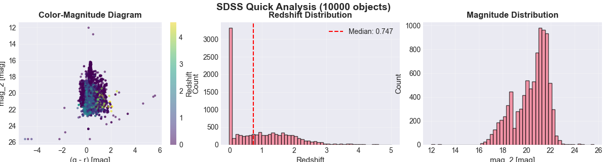
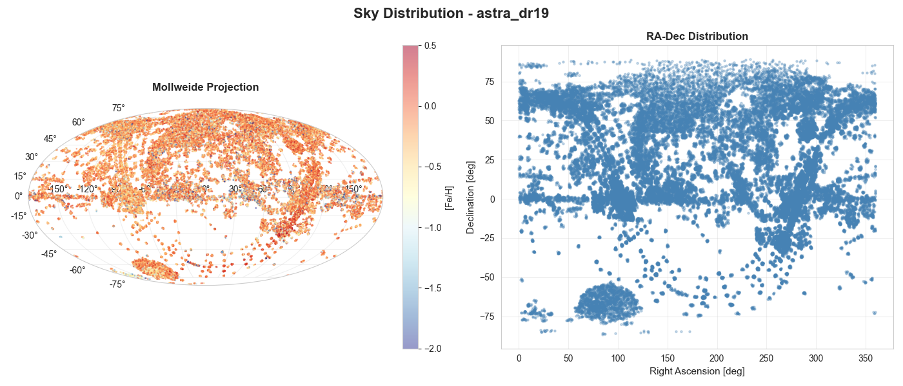
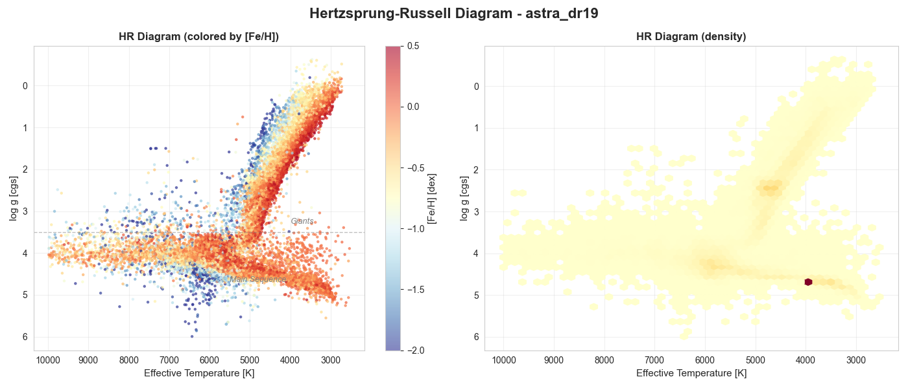
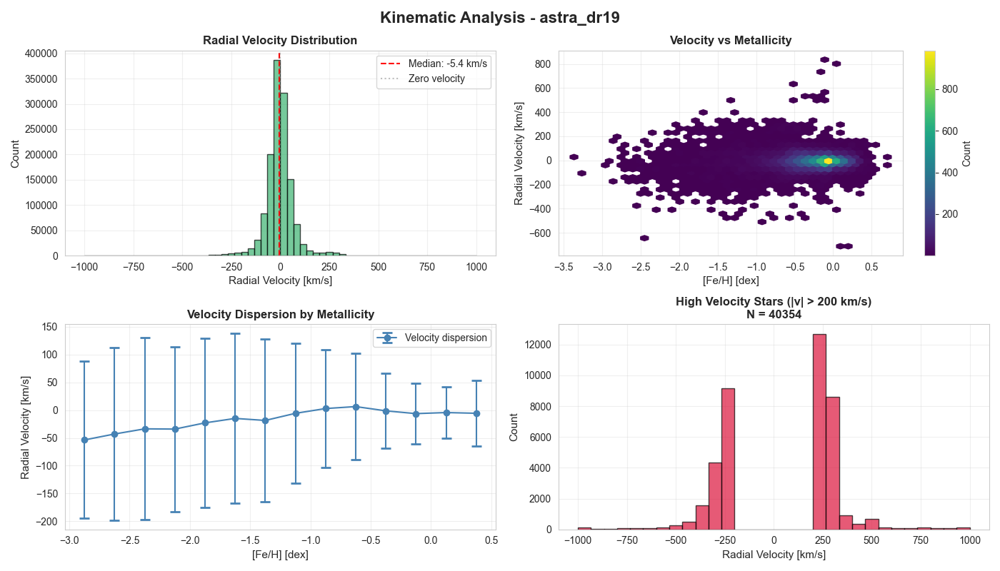

# 🔭 SDSS Data Analysis Pipeline

A comprehensive Python pipeline for downloading, processing, and analyzing data from the Sloan Digital Sky Survey (SDSS) Data Release 19.

**Author:** Cris Luna

[](https://doi.org/10.5281/zenodo.17375604)
[](https://www.gnu.org/licenses/agpl-3.0)

---

## 📋 Overview

This pipeline provides a complete workflow for SDSS data analysis:
- **Automated downloads** from SDSS DR19 archives
- **Efficient processing** of FITS files to Parquet format
- **Specialized analysis modules** for different data types
- **Publication-quality visualizations**

### Supported Data Types

1. **Spectroscopic Data** (Optical spectra - DR17, DR19)
2. **APOGEE Data** (Infrared spectra - allStar & allVisit)
3. **ASTRA Data** (Stellar parameter pipeline results)
4. **Photometric Data** (Imaging catalogs)

---

## 🚀 Quick Start

### Installation

1. **Clone or download this repository**

2. **Install dependencies:**
```bash
pip install numpy pandas matplotlib seaborn astropy requests urllib3 pyarrow
```

Or use the requirements file:
```bash
pip install -r requirements.txt
```

### Basic Usage

**Step 1: Download and Process Data**
```bash
python sdss_pipeline.py
```

This will:
- Show available SDSS catalogs
- Prompt you to download missing catalogs
- Process FITS files into efficient Parquet format
- Generate quick visualizations

**Step 2: Run Analyses**
```bash
# Interactive menu for all analyses
python sdss_master_analysis.py

# Or run individual analyses
python sdss_spectro_analysis.py
python sdss_apogee_analysis.py
python sdss_astra_analysis.py
```

---

## 📁 Project Structure

```
sdss_pipeline/
├── sdss_pipeline.py              # Main download & processing pipeline
├── sdss_master_analysis.py       # Unified analysis interface
├── sdss_spectro_analysis.py      # Spectroscopic data analyzer
├── sdss_apogee_analysis.py       # APOGEE infrared analyzer
├── sdss_astra_analysis.py        # ASTRA stellar parameter analyzer
├── README.md                      # This file
├── LICENSE                        # AGPL-3.0 license
├── requirements.txt               # Python dependencies
├── .gitignore                     # Git ignore rules
│
├── sdss_data/                     # Data directory (created automatically)
│   ├── raw/                       # Downloaded FITS files
│   │   ├── spAll-v6_1_3.fits.gz
│   │   ├── allStar-1.3-apo25m.fits
│   │   ├── allVisit-1.3-apo25m.fits
│   │   └── astraMWMLite-0.6.0.fits.gz
│   │
│   └── processed/                 # Processed Parquet files
│       ├── spectro_dr19_processed.parquet
│       ├── apogee_allstar_processed.parquet
│       ├── apogee_allvisit_processed.parquet
│       ├── astra_dr19_processed.parquet
│       ├── apogee_combined.parquet          # Special: allStar + allVisit merged
│       └── astra_with_populations.parquet   # Special: with population labels
│
└── output_data_examples/          # Analysis outputs
    ├── sdss_quick_analysis_astra_dr19.png
    └── sdss_quick_analysis_spectro_dr19.png
```

---

## 📊 Available Catalogs

### Spectroscopic Catalogs (Optical)

| Catalog ID | Description | Size | DR | Objects |
|------------|-------------|------|-----|---------|
| `spectro_dr19` | SDSS-V Optical Spectroscopy | 985 MB | DR19 | ~2.2M |
| `spectro_dr17` | SDSS I-IV Legacy Spectroscopy | 6.7 GB | DR17 | ~5.3M |

**Key Features:**
- Redshift measurements
- Object classification (galaxy, QSO, star)
- Optical magnitudes (ugriz)
- Signal-to-noise ratios

### APOGEE Catalogs (Infrared)

| Catalog ID | Description | Size | Version | Stars |
|------------|-------------|------|---------|-------|
| `apogee_allstar` | Stellar Parameters per Star | 368 MB | 1.3 | ~660K |
| `apogee_allvisit` | Individual Visit Spectra | 909 MB | 1.3 | ~2.4M visits |

**Key Features:**
- Effective temperature (Teff)
- Surface gravity (log g)
- Metallicity ([Fe/H])
- Alpha enhancement ([α/M])
- Radial velocities
- Multiple visits per star

### ASTRA Catalogs (Stellar Analysis)

| Catalog ID | Description | Size | Version | Objects |
|------------|-------------|------|---------|---------|
| `astra_dr19` | Multi-Pipeline Stellar Parameters | 854 MB | 0.6.0 | ~1.3M |

**Key Features:**
- Results from multiple pipelines (FERRE, The Payne, SLAM)
- Both BOSS and APOGEE spectra analyzed
- Chemical abundances
- Kinematic properties

### Photometric Catalogs

| Catalog ID | Description | Size | DR | Note |
|------------|-------------|---------|-----|------|
| `photo_dr17` | Photometric Position Matches | 16 GB | DR17 | Very large! |

---

## 🔬 Analysis Modules

### 1. Spectroscopic Analysis (`sdss_spectro_analysis.py`)

**Analyses:**
- Redshift distribution (full, low-z, cumulative)
- Object classification breakdown
- Color-magnitude diagrams (multiple colors)
- Sky distribution (Mollweide projection)
- Signal-to-noise analysis

**Example:**
```python
from sdss_spectro_analysis import load_and_analyze

# Load and analyze
analyzer = load_and_analyze('spectro_dr19')

# Run full analysis (all plots)
analyzer.full_analysis()

# Or individual analyses
analyzer.print_summary()
analyzer.plot_redshift_analysis()
analyzer.plot_classification_analysis()
analyzer.plot_color_magnitude_diagram()
analyzer.plot_sky_distribution()
```

**Outputs:**
- 6 redshift analysis plots
- Classification pie charts
- Multiple color-magnitude diagrams
- Sky coverage maps

### 2. APOGEE Analysis (`sdss_apogee_analysis.py`)

**Analyses:**
- HR diagrams (Teff vs log g)
- Stellar parameter distributions
- Chemical abundance analysis
- Visit statistics and SNR improvement
- **Combined allStar + allVisit analysis**

**Example:**
```python
from sdss_apogee_analysis import load_and_analyze

# Load both catalogs
analyzer = load_and_analyze('apogee_allstar', 'apogee_allvisit')

# Run full analysis
analyzer.full_analysis()

# Combine allStar with visit statistics
combined = analyzer.combine_allstar_allvisit()
# Saves to: sdss_data/processed/apogee_combined.parquet

# Individual plots
analyzer.plot_hr_diagram()
analyzer.plot_stellar_parameters()
analyzer.plot_visit_analysis()
analyzer.plot_sky_distribution()
```

**Outputs:**
- HR diagrams (colored by [Fe/H] and [α/M])
- 6 stellar parameter distribution plots
- Visit analysis (SNR vs number of visits)
- Combined catalog with visit statistics

### 3. ASTRA Analysis (`sdss_astra_analysis.py`)

**Analyses:**
- Chemical abundance patterns ([Fe/H], [α/M])
- **Galactic population identification** (thin disk, thick disk, halo)
- Kinematic analysis (radial velocities)
- HR diagrams colored by chemistry
- Multi-pipeline comparison

**Example:**
```python
from sdss_astra_analysis import load_and_analyze

# Load and analyze
analyzer = load_and_analyze('astra_dr19')

# Run full analysis
analyzer.full_analysis()

# Identify stellar populations
pop_data = analyzer.identify_stellar_populations()
# Saves to: sdss_data/processed/astra_with_populations.parquet

# Individual analyses
analyzer.plot_chemical_abundances()
analyzer.plot_kinematics()
analyzer.plot_hr_diagram()
analyzer.compare_pipelines()
```

**Outputs:**
- 6 chemical abundance plots
- Population classification (thin disk, thick disk, halo)
- Kinematic analysis plots
- Pipeline comparison diagrams
- Catalog with population labels

### 4. Master Analysis (`sdss_master_analysis.py`)

**Unified interface for all analyses:**

```python
from sdss_master_analysis import SDSSMasterAnalyzer

# Initialize
master = SDSSMasterAnalyzer()

# List what's available
master.list_available_catalogs()

# Run specific analysis
spectro = master.analyze_spectroscopic('spectro_dr19')
apogee = master.analyze_apogee()
astra = master.analyze_astra('astra_dr19')

# Or run everything
results = master.analyze_all()

# Interactive menu
master.interactive_menu()
```

---

## 💡 Usage Tips

### Memory Management

For large catalogs, control memory usage with `max_rows`:

```python
# In sdss_pipeline.py, modify main():
pipeline, data = main(max_rows=10000)   # Quick test (10K rows)
pipeline, data = main(max_rows=100000)  # Medium sample (100K rows)
pipeline, data = main(max_rows=None)    # Full dataset (WARNING: Memory intensive!)
```

### Quick Data Reload

Parquet files load much faster than FITS:

```python
import pandas as pd

# Fast: Direct parquet read
spectro = pd.read_parquet('sdss_data/processed/spectro_dr19_processed.parquet')
apogee = pd.read_parquet('sdss_data/processed/apogee_allstar_processed.parquet')
astra = pd.read_parquet('sdss_data/processed/astra_dr19_processed.parquet')

# Extra fast: Load only specific columns
spectro_light = pd.read_parquet(
    'sdss_data/processed/spectro_dr19_processed.parquet',
    columns=['ra', 'dec', 'z', 'class']
)
```

### Custom Analysis

Extend any analyzer:

```python
from sdss_spectro_analysis import SpectroscopicAnalyzer

class MyAnalyzer(SpectroscopicAnalyzer):
    def my_custom_plot(self):
        """Your custom analysis"""
        import matplotlib.pyplot as plt
        
        fig, ax = plt.subplots()
        # Your code here
        ax.hist(self.data['z'], bins=100)
        plt.show()

# Use it
data = pd.read_parquet('sdss_data/processed/spectro_dr19_processed.parquet')
analyzer = MyAnalyzer(data, "Custom Analysis")
analyzer.my_custom_plot()
```

---

## 📈 Output Files

### Processed Data Files

All in `sdss_data/processed/`:

| File | Source | Description |
|------|--------|-------------|
| `spectro_dr19_processed.parquet` | DR19 optical | Processed spectroscopic catalog |
| `spectro_dr17_processed.parquet` | DR17 optical | Legacy spectroscopic catalog |
| `apogee_allstar_processed.parquet` | APOGEE 1.3 | One row per star |
| `apogee_allvisit_processed.parquet` | APOGEE 1.3 | One row per visit |
| `astra_dr19_processed.parquet` | ASTRA 0.6.0 | Stellar parameters |
| **`apogee_combined.parquet`** | Generated | allStar + visit statistics |
| **`astra_with_populations.parquet`** | Generated | ASTRA + population labels |

### Visualization Outputs

In `output_data_examples/`:
- `sdss_quick_analysis_*.png` - Quick overview plots from pipeline
- Additional plots generated by analysis modules

---

## ⚠️ Common Issues & Solutions

### 1. Download Failures

**Problem:** Download interrupted or connection error

**Solutions:**
```python
# Option 1: Retry download
pipeline.data_manager.download_catalog('spectro_dr19', force=True)

# Option 2: Check SDSS server status
# Visit: https://dr19.sdss.org

# Option 3: Use rsync for more reliable downloads (see SDSS documentation)
```

### 2. Memory Errors

**Problem:** `MemoryError` or system slowdown

**Solutions:**
- Reduce `max_rows` parameter: `main(max_rows=10000)`
- Process one catalog at a time
- Close other applications
- Use a machine with more RAM
- Consider using a subset for development

### 3. Missing Columns

**Problem:** `KeyError` for expected column

**Solutions:**
```python
# Check available columns
print(data.columns.tolist())

# Different catalog versions have different columns
# DR19 vs DR17 have different schemas

# Use hasattr or try/except
if 'z' in analyzer.data.columns:
    analyzer.plot_redshift_analysis()
```

### 4. Import Errors

**Problem:** `ModuleNotFoundError`

**Solution:**
```bash
# Install all dependencies
pip install numpy pandas matplotlib seaborn astropy requests urllib3 pyarrow

# Or use requirements.txt
pip install -r requirements.txt

# Upgrade if needed
pip install --upgrade astropy
```

### 5. FITS File Corruption

**Problem:** Error loading FITS file

**Solutions:**
```python
# Re-download the file
pipeline.data_manager.download_catalog('spectro_dr19', force=True)

# Check file integrity
import os
file_path = 'sdss_data/raw/spAll-v6_1_3.fits.gz'
print(f"File size: {os.path.getsize(file_path)} bytes")

# Remove corrupted file and re-download
os.remove(file_path)
```

---

## 🎯 Advanced Usage

### Batch Processing Multiple Catalogs

```python
from sdss_pipeline import SDSSPipeline

pipeline = SDSSPipeline()

# Define catalogs to process
catalogs = ['spectro_dr19', 'apogee_allstar', 'apogee_allvisit', 'astra_dr19']

for cat_id in catalogs:
    print(f"\n{'='*60}\nProcessing: {cat_id}\n{'='*60}")
    
    # Download if not present
    pipeline.data_manager.download_catalog(cat_id)
    
    # Process
    data = pipeline.load_catalog(cat_id, max_rows=None)
    
    print(f"✓ Completed {cat_id}: {len(data)} objects")
```

### Cross-Matching Catalogs

```python
import pandas as pd

# Load multiple catalogs
spectro = pd.read_parquet('sdss_data/processed/spectro_dr19_processed.parquet')
astra = pd.read_parquet('sdss_data/processed/astra_dr19_processed.parquet')

# Merge on common identifier (if available)
# Note: Check column names first!
if 'sdss_id' in spectro.columns and 'sdss_id' in astra.columns:
    merged = spectro.merge(astra, on='sdss_id', suffixes=('_spec', '_astra'))
    print(f"✓ Cross-matched {len(merged)} objects")
    
    # Save merged catalog
    merged.to_parquet('sdss_data/processed/spectro_astra_merged.parquet')
```

### Export to Other Formats

```python
import pandas as pd
from astropy.table import Table

data = pd.read_parquet('sdss_data/processed/spectro_dr19_processed.parquet')

# Export to CSV (warning: large file!)
data.to_csv('spectro_dr19.csv', index=False)

# Export to HDF5
data.to_hdf('spectro_dr19.h5', key='data', mode='w')

# Export back to FITS
table = Table.from_pandas(data)
table.write('spectro_dr19_export.fits', overwrite=True)

# Export subset to JSON
subset = data.head(1000)
subset.to_json('spectro_dr19_sample.json', orient='records')
```

### Filter High-Quality Data

```python
# High S/N spectroscopic data
high_quality_spectro = data[
    (data['sn_median_all'] > 10) &
    (data['z'] > 0) &
    (data['z'] < 1) &
    (data['z'].notna())
]

# High-quality APOGEE stars
high_quality_apogee = apogee_data[
    (apogee_data['snr'] > 100) &
    (apogee_data['teff'] > 4000) &
    (apogee_data['teff'] < 7000) &
    (apogee_data['logg'] > 0) &
    (apogee_data['logg'] < 5)
]

# Metal-poor stars from ASTRA
metal_poor = astra_data[
    (astra_data['fe_h'] < -1.0) &
    (astra_data['fe_h'].notna())
]

print(f"High-quality spectro: {len(high_quality_spectro)}")
print(f"High-quality APOGEE: {len(high_quality_apogee)}")
print(f"Metal-poor stars: {len(metal_poor)}")
```

---

## 📚 Data Sources & Documentation

### SDSS Official Resources

- **Main Website:** https://www.sdss.org/
- **Data Release 19:** https://dr19.sdss.org/
- **DR19 Documentation:** https://www.sdss.org/dr19/
- **Data Access:** https://www.sdss.org/dr19/data_access/
- **SAS (Science Archive Server):** https://data.sdss.org/sas/

### Specific Documentation

- **Spectroscopic Data:** https://www.sdss.org/dr19/spectro/
- **APOGEE:** https://www.sdss.org/dr19/irspec/
- **ASTRA:** https://www.sdss.org/dr19/irspec/astra/
- **Photometry:** https://www.sdss.org/dr19/imaging/

### Tutorials & Examples

- **SDSS Tutorials:** https://www.sdss.org/dr19/tutorials/
- **API Documentation:** https://api.sdss.org/
- **SkyServer:** http://skyserver.sdss.org/

---

## 📖 Citation

### Citing This Software

If you use this pipeline in your research, please cite:

**BibTeX:**
```bibtex
@software{luna2025sdss,
  author       = {Luna, Cristina},
  title        = {{SDSS Data Pipeline: Automated Download and 
                   Analysis of Sloan Digital Sky Survey Catalogs}},
  year         = 2025,
  publisher    = {Zenodo},
  version      = {v1.0.0},
  doi          = {10.5281/zenodo.17375604},
  url          = {https://doi.org/10.5281/zenodo.17375604}
}
```

**Plain text:**
```
C. Luna (2025), SDSS Data Pipeline: Automated Download and Analysis of 
Sloan Digital Sky Survey Catalogs, DOI: 10.5281/zenodo.17375604
```

### Citing SDSS Data

**You must also cite the SDSS data releases you use:**

**SDSS DR19:**
```bibtex
@article{sdss_dr19,
  author       = {{Almeida}, A. and {Anderson}, S.~F. and others},
  title        = {{The Nineteenth Data Release of the Sloan Digital Sky Surveys}},
  journal      = {ApJS},
  year         = 2024,
  note         = {In preparation}
}
```

**SDSS General Acknowledgment:**
```
Funding for the Sloan Digital Sky Survey (SDSS) has been provided by the 
Alfred P. Sloan Foundation, the Participating Institutions, the National 
Aeronautics and Space Administration, the National Science Foundation, the 
U.S. Department of Energy, the Japanese Monbukagakusho, and the Max Planck 
Society.
```

For detailed citation guidelines: https://www.sdss.org/collaboration/citing-sdss/

### Example Acknowledgment in Papers

> "Data were obtained from the Sloan Digital Sky Survey Data Release 19. Data 
> analysis was performed using the SDSS Data Pipeline (Luna 2025, DOI: 
> 10.5281/zenodo.17375604), which facilitated the download and processing of 
> SDSS spectroscopic and infrared catalogs."

---

## 📄 License

### Pipeline Code

This software is licensed under the **GNU Affero General Public License v3.0 (AGPL-3.0)**.

[](https://www.gnu.org/licenses/agpl-3.0)

```
SDSS Data Pipeline
Copyright (C) 2025 Cris Luna

This program is free software: you can redistribute it and/or modify
it under the terms of the GNU Affero General Public License as published
by the Free Software Foundation, either version 3 of the License, or
(at your option) any later version.

This program is distributed in the hope that it will be useful,
but WITHOUT ANY WARRANTY; without even the implied warranty of
MERCHANTABILITY or FITNESS FOR A PARTICULAR PURPOSE. See the
GNU Affero General Public License for more details.
```

**What this means:**
- ✅ **Free to use** for any purpose (research, education, commercial)
- ✅ **Free to modify** and adapt to your needs
- ✅ **Free to distribute** copies and modifications
- ⚠️ **Share-alike**: Modified versions must also be AGPL-3.0
- ⚠️ **Network use**: Server deployments must provide source code
- ⚠️ **Attribution required**: Must preserve copyright notices

Full license: [LICENSE](LICENSE) or https://www.gnu.org/licenses/agpl-3.0.html

### SDSS Data

**The astronomical data accessed through this pipeline belongs to the SDSS Collaboration:**

- 🌍 **Public Domain**: SDSS data are freely available
- 📚 **No proprietary period**: All data are immediately public
- 🤝 **Attribution requested**: Proper citation is required by scientific courtesy

See: https://www.sdss.org/collaboration/data-access-policy/

### Third-Party Dependencies

| Library | License | Purpose |
|---------|---------|---------|
| [NumPy](https://numpy.org) | BSD-3-Clause | Numerical computing |
| [Pandas](https://pandas.pydata.org) | BSD-3-Clause | Data manipulation |
| [Matplotlib](https://matplotlib.org) | PSF-based | Visualization |
| [Seaborn](https://seaborn.pydata.org) | BSD-3-Clause | Statistical plots |
| [Astropy](https://www.astropy.org) | BSD-3-Clause | Astronomy tools |
| [PyArrow](https://arrow.apache.org) | Apache-2.0 | Parquet format |

All dependencies are compatible with AGPL-3.0.

### Disclaimer

```
THE SOFTWARE IS PROVIDED "AS IS", WITHOUT WARRANTY OF ANY KIND, EXPRESS OR 
IMPLIED, INCLUDING BUT NOT LIMITED TO THE WARRANTIES OF MERCHANTABILITY, 
FITNESS FOR A PARTICULAR PURPOSE AND NONINFRINGEMENT.
```

This pipeline is **not officially endorsed** by the SDSS Collaboration.

---

## 🔧 Development

### Contributing

Contributions are welcome! To contribute:

1. Fork the repository
2. Create a feature branch (`git checkout -b feature/amazing-feature`)
3. Commit your changes (`git commit -m 'Add amazing feature'`)
4. Push to the branch (`git push origin feature/amazing-feature`)
5. Open a Pull Request

### Code Style

- Follow PEP 8 guidelines
- Use type hints where possible
- Add docstrings to all functions
- Comment complex algorithms
- Keep functions focused and modular

### Testing

```python
# Test individual components
python sdss_pipeline.py  # Test with max_rows=1000

# Test analysis modules
python sdss_spectro_analysis.py
python sdss_apogee_analysis.py
python sdss_astra_analysis.py

# Test master interface
python sdss_master_analysis.py
```

### Future Enhancements

Planned features:
- [ ] MaNGA datacube analysis module
- [ ] Cross-matching with Gaia DR3
- [ ] Machine learning classification tools
- [ ] Interactive Plotly/Bokeh dashboards
- [ ] Jupyter notebook examples
- [ ] Docker containerization
- [ ] Unit tests suite
- [ ] API for programmatic access
- [ ] SQL database integration option

---

## 📞 Support

### Getting Help

1. **Check this README** - Most common issues are covered here
2. **Review code comments** - Each module has extensive documentation
3. **SDSS Documentation** - https://www.sdss.org/dr19/
4. **GitHub Issues** - Report bugs or request features

### Reporting Issues

When reporting issues, please include:
- Python version (`python --version`)
- Operating system
- Full error message and traceback
- Steps to reproduce
- Relevant code snippet

### Contact

- **Code Issues**: Open a GitHub issue
- **SDSS Data Questions**: https://www.sdss.org/help/
- **General Inquiries**: See repository contacts

---

## 🎓 Educational Use

This pipeline is ideal for:
- **Astronomy courses** - Teaching observational data analysis
- **Research projects** - Quick access to large datasets
- **Student projects** - Learning Python and data science
- **Workshops** - Hands-on SDSS data experience

### Teaching Examples

**Example 1: Galaxy Redshift Survey**
```python
# Load spectroscopic data
from sdss_spectro_analysis import load_and_analyze

analyzer = load_and_analyze('spectro_dr19')

# Filter for galaxies
galaxies = analyzer.data[analyzer.data['class'] == 'GALAXY']

# Analyze redshift distribution
analyzer.data = galaxies
analyzer.plot_redshift_analysis()
```

**Example 2: Stellar Population Study**
```python
# Load ASTRA data
from sdss_astra_analysis import load_and_analyze

analyzer = load_and_analyze('astra_dr19')

# Classify into Galactic populations
pop_data = analyzer.identify_stellar_populations()

# Analyze chemistry
analyzer.plot_chemical_abundances()
```

**Example 3: HR Diagram**
```python
# Load APOGEE data
from sdss_apogee_analysis import load_and_analyze

analyzer = load_and_analyze('apogee_allstar')

# Create HR diagram
analyzer.plot_hr_diagram()
```

---

## 🏆 Acknowledgments

### Data Providers

- **SDSS Collaboration** - For providing public access to survey data
- **SDSS Data Archive** - For maintaining reliable data servers

### Software Dependencies

- **Astropy Community** - For excellent astronomy tools
- **Pandas/NumPy Teams** - For powerful data analysis libraries
- **Matplotlib/Seaborn** - For visualization capabilities

### Special Thanks

- SDSS helpdesk for documentation support
- Open-source community for inspiration
- All contributors to this project

---

## 📊 Statistics

### Project Stats

- **Lines of Code**: ~3,500+
- **Modules**: 5 main Python files
- **Supported Catalogs**: 6 major SDSS catalogs
- **Analysis Functions**: 30+ specialized functions
- **Visualization Types**: 20+ different plot types

### Data Coverage

When fully downloaded:
- **Spectroscopic Objects**: ~7.5 million
- **APOGEE Stars**: ~660,000 unique stars
- **ASTRA Analyzed**: ~1.3 million objects
- **Total Raw Data**: ~25+ GB compressed
- **Processed Data**: More efficient in Parquet format

---

## 🗺️ Roadmap

### Version 0.1 (Current)
- ✅ Basic data download and processing
- ✅ Spectroscopic analysis module
- ✅ APOGEE analysis module
- ✅ ASTRA analysis module
- ✅ Master analysis interface
- ✅ Comprehensive documentation

### Version 1.0 (Planned)
- [ ] Performance optimizations
- [ ] Additional catalog support (MaNGA)
- [ ] Jupyter notebook tutorials
- [ ] Web-based visualization dashboard
- [ ] Automated testing suite

### Version 2.0 (Future)
- [ ] Integration with other surveys (Gaia, 2MASS)
- [ ] Machine learning modules
- [ ] Real-time data access
- [ ] Cloud deployment options
- [ ] REST API interface

---

## 📝 Changelog

### v1.0.0 (2025-01-XX)
- Initial release
- Complete pipeline for DR19 data
- Support for spectroscopic, APOGEE, and ASTRA catalogs
- Comprehensive analysis modules
- Full documentation

---

## ❓ FAQ

**Q: How much disk space do I need?**
A: Minimum 2-3 GB for basic catalogs, up to 30+ GB for all catalogs including photometry.

**Q: Can I use this with older SDSS data releases?**
A: Partially. The code is designed for DR19 but can be adapted for DR17. Older releases may require modifications.

**Q: Is internet connection required?**
A: Only for downloading data. Once downloaded, all analysis works offline.

**Q: Can I run this on a laptop?**
A: Yes! Use `max_rows` parameter to limit memory usage. Full catalogs require 8+ GB RAM.

**Q: How long does it take to download all catalogs?**
A: Depends on internet speed. Typically 30 minutes to 2 hours for all major catalogs.

**Q: Can I customize the analysis?**
A: Absolutely! All analysis classes can be extended and customized for your needs.

**Q: Is this production-ready?**
A: Yes for research use. For critical applications, always validate results independently.

**Q: How do I update to new SDSS data releases?**
A: Modify the URLs in `sdss_pipeline.py` CATALOGS dictionary to point to new releases.

---

**Happy analyzing! 🌌✨**

*For questions, issues, or contributions, please visit the GitHub repository.*

---

### Examples Spectroscopic Analysis (`sdss_spectro_analysis.py`)

**Analyses:**
- Redshift distribution (full, low-z, cumulative)
- Object classification breakdown
- Color-magnitude diagrams (multiple colors)
- Sky distribution (Mollweide projection)
- Signal-to-noise analysis

**Example:**
```python
from sdss_spectro_analysis import load_and_analyze

# Load and analyze
analyzer = load_and_analyze('spectro_dr19')

# Run full analysis (all plots)
analyzer.full_analysis()

# Or individual analyses
analyzer.print_summary()
analyzer.plot_redshift_analysis()
analyzer.plot_classification_analysis()
analyzer.plot_color_magnitude_diagram()
analyzer.plot_sky_distribution()
```

**Outputs:**
- 6 redshift analysis plots
- Classification pie charts
- Multiple color-magnitude diagrams
- Sky coverage maps

**Example Visualization:**



*Figure: Quick analysis of SDSS DR19 spectroscopic data showing color-magnitude diagram, sky distribution, redshift distribution, magnitude distribution, and classification breakdown. This automated visualization reveals the survey's coverage of ~2.2M objects across the sky with redshifts ranging from local galaxies (z~0) to distant quasars (z>3).*


**Other visualisations:**








**Last Updated:** October 2025  
**Version:** 1.0.0  
**Author:** Cristina Luna  
**License:** AGPL-3.0